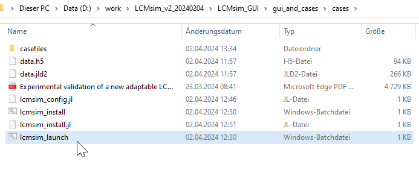

# Installation 

The intended operating system for LCMsim v2 is Windows. The software was extensively tested for Windows 10. In order to use LCMsim v2 for filling simulations perform the following steps:
- Download LCMsim v2: [Latest release](assets/LCMsim_v2_latestrelease.zip)
- Extract and double click on the batch file to install the missing Julia packages
```@raw html

```
- Configure lcmsim_config.jl :
i_batch=0
i_model=2
i_mesh=2
mypath=joinpath(pwd())
repositorypath="D:\\work\\LCMsim_v2_20240423_test\\LCMsim_v2.jl"
guipath="D:\\work\\LCMsim_v2_20240423_test\\LCMsim_GUI\\gui_and_cases\\gui"
include(joinpath(guipath,"lcmsim_v2_gui_gtk4.jl"))
- Launch the GUI in the cases folder :```@raw html

```
-Different GUI layout but same functionalities